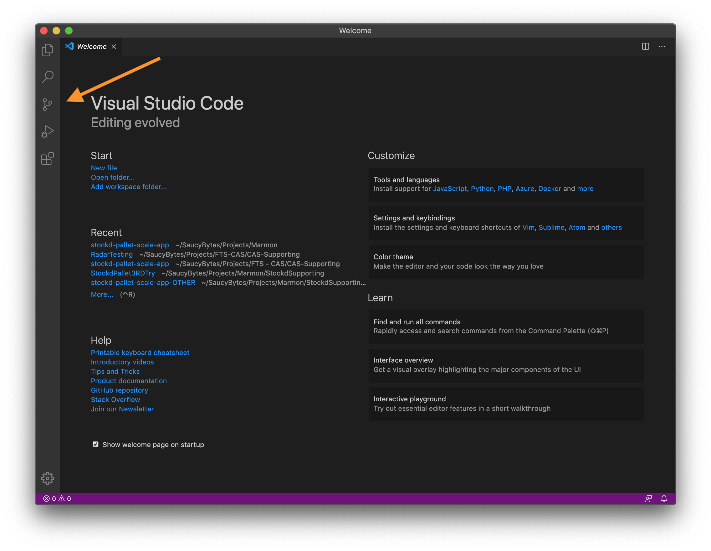
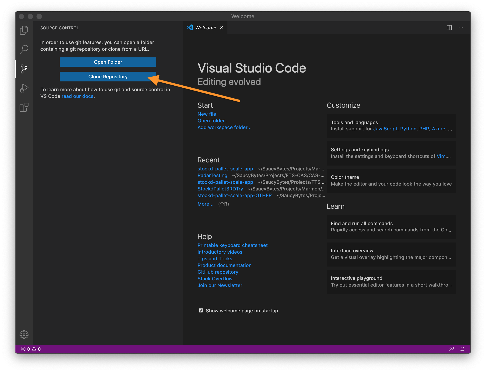
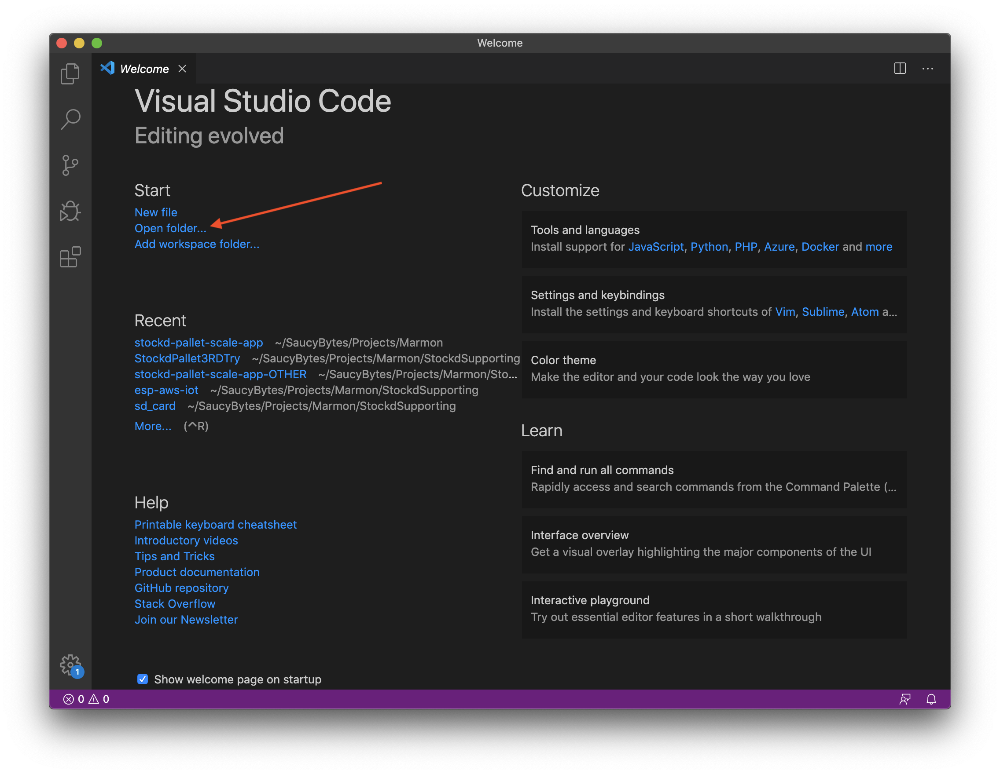
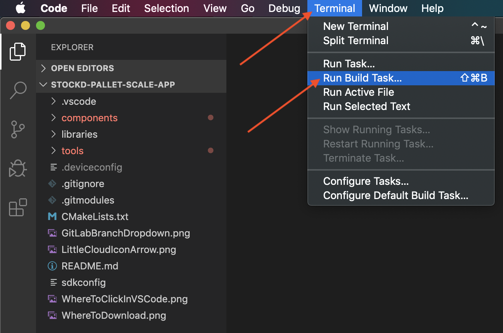

# SaucyBytes ESP32 Base

## Overview

This repository holds a base all-in-one build setup for ESP32. Included are the tools required for VS Code compilation, upload and flashing the ESP32. To get this project running on your machine follow the steps below.

## VS Code environment setup

1. Download the prerequisites:
    1. VS Code editor from their [downloads page](https://code.visualstudio.com/download).
    2. Python3 for your operating system from [thier website](https://realpython.com/installing-python/).
    3. Git source control from their [downloads page](https://git-scm.com/book/en/v2/Getting-Started-Installing-Git).
2. You will need to download the CP210x driver from [here](https://www.silabs.com/products/development-tools/software/usb-to-uart-bridge-vcp-drivers).
    1. **Windows** - Download the driver for Windows 10 Universal. If using Windows 7 or 8 be sure to select the correct driver.
    2. **Mac OS** - The driver listed should work for all current versions of Mac OS - Note: You may have to open the Security tab in System Preferences and press *Allow* during or after installation for proper operation.
    3. **Linux** - The CP210x driver should be installed by default. There is a link on the page if your distribution does not include the driver.
3. Copy the following command: ```git clone https://github.com/SaucyBytes/SB-Base-ESP32.git```
4. Open up the VS Code application we downloaded in Step 1.
5. Once in VS Code, press the button that looks like a fork in the road on the far left side of the window as seen below.

5. Once here, press the blue button with "Clone Repository" as seen below.

6. Paste in the URL copied from Step 3 and press enter. VS Code will ask you where you'd like to save the folder. Take note of where you put it as you'll need this in the next step.
7. Use the *Open folder...* option and navigate to the *SB-Base-ESP32* folder you just cloned. Press *Open*. See image below.

8. Once the folder has opened, it is time to run the build tasks. Navigate to the *Terminal* tab in the menu bar. Select *Run Build Task...*.

9. Use the arrow keys to select "Clean and Build" and give it a minute to compile all the code.
10. Plug your M5Stack into your computer using the included USB-C cable. 
11. Repeat Step 8 to open the build tasks menu again. This time press *Flash*.

Your ESP32 should now be flashed with the firmware!